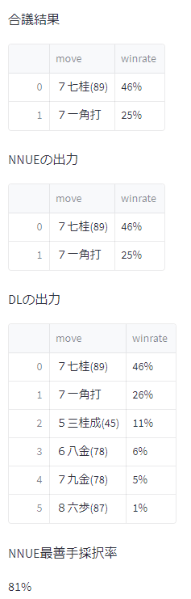

# shogi-gougi
将棋AIの合議実験

# 設定ファイル

将棋所からUSIエンジン登録用のバッチファイル例(Windows, Anaconda)

```
@echo off 
call C:\Users\xxx\Anaconda3\Scripts\activate.bat C:\Users\xxx\Anaconda3\envs\envname 
python usiproxy.py | "C:\Program Files\Git\usr\bin\tee.exe" -a tee.log
```

Macの例 (homebrew->anyenv->pyenv依存関係の場合)

```sh
#!/bin/sh

eval $(/usr/local/bin/brew shellenv)
eval "$(anyenv init -)"
eval "$(pyenv init --path)"

python usiproxy.py 2>>error.log | tee -a tee.log
```

エンジンオプションの `optionfile` で指定する設定ファイル

```yaml
engines:
    - exe: "D:\\dev\\shogi\\Suisho5-YaneuraOu-v7.5.0-windows\\YaneuraOu_NNUE-tournament-clang++-avx2.exe"
      option: |
        setoption name Threads value 4
        setoption name MultiPV value 2
      winrate_regression:
        weight: 0.005159566005071004
        bias: -0.020755892619490623
    - exe: "D:\\dev\\shogi\\YaneuraOu-Deep-TensorRT-V761\\YaneuraOu-Deep-TensorRT.exe"
      option: |
        setoption name DNN_Batch_Size1 value 8
        setoption name MultiPV value 5
      winrate_regression:
        weight: 0.0018064252535502116
        bias: -0.08914890885353088
params:
    method: blend
    engine_weights: [0.5, 0.5]
    max_move_count: 64
```

# 合議結果の可視化

```
streamlit run streamlit_visualize.py -- tee.log
```

Webブラウザが開き、リアルタイムで合議結果が表示される。


